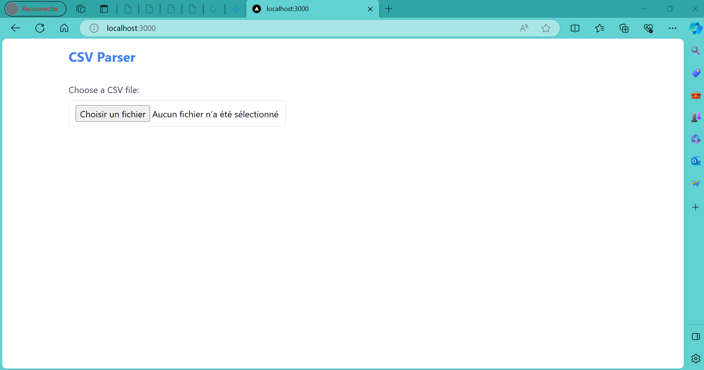
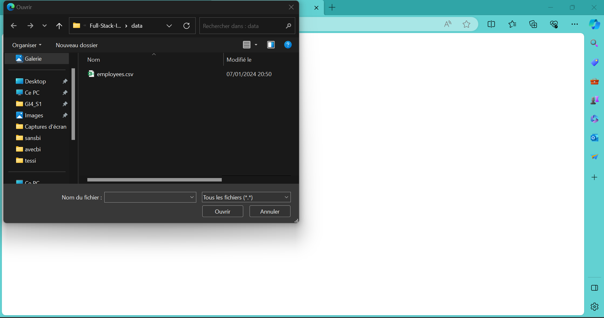
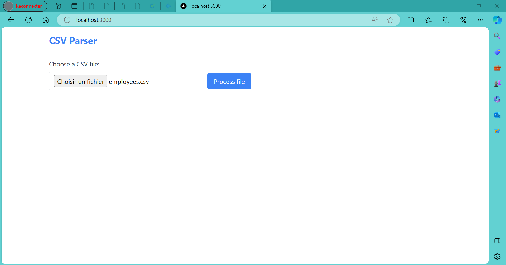
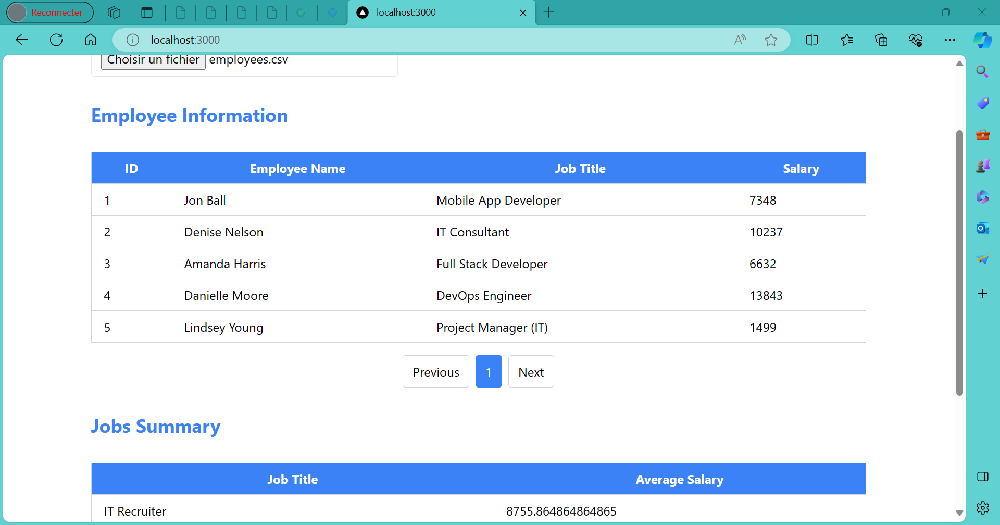

## DNA Engineering Full-Stack Assignment
Build a CSV Parser.
# CSV Parser

## Table of Contents
- [Demo Video](#demo-video)
- [CSV Parser Backend](#csv-parser-backend)
  - [Approach](#approach)
  - [Instructions](#instructions)
  - [Unit Tests](#unit-tests)
  - [Test Endpoints](#test-endpoints)
- [CSV Parser Frontend](#csv-parser-frontend)
  - [Project Structure](#project-structure)
  - [Dependencies](#dependencies)
  - [Instructions to Run](#instructions-to-run)
  - [Usage](#usage)

# Demo Video
[Watch Demo Video](https://drive.google.com/file/d/1-oaK8OdXHSDi60gbBo5uUSXfDcYhZXbG/view?usp=sharing)

# CSV Parser Backend
## Approach

*The provided Spring Boot backend application employs a simple CSV parsing strategy using a BufferedReader to read and process CSV content without relying on external libraries. This approach ensures efficiency and simplicity in handling CSV data.*

### Employee Model
The `Employee` class is a simple Java model representing the structure of an employee. It includes fields for the employee's ID, name, job title, and salary. The use of Lombok annotations (`@Getter`, `@Setter`, `@NoArgsConstructor`, `@AllArgsConstructor`, `@ToString`) helps reduce boilerplate code.

### CsvParser Interface
The `CsvParser` interface defines a method `parseCsv` that takes an `InputStream` as input and returns a list of `Employee` objects. This interface provides a contract for different implementations of CSV parsers.

### CsvParserImpl Implementation
The `CsvParserImpl` class implements the `CsvParser` interface. It uses a `BufferedReader` to read the CSV data line by line, skipping the header. It then parses each line into `Employee` objects and adds them to a list.

### ParserService
The `ParserService` class is responsible for handling the logic related to CSV file processing. It uses the `CsvParser` to parse the CSV file and stores the data in a list of `Employee` objects. It provides methods to retrieve all employees and calculate average salaries based on job titles.

### ParseController
The `ParseController` is a Spring MVC controller that handles HTTP requests related to CSV parsing. It uses the `ParserService` to upload, process, and retrieve data. It includes endpoints for uploading a CSV file, getting a list of all employees, and retrieving average salaries by job title.

## Instructions 

- **Instructions to Run the Backend**: `mvn spring-boot:run`
  - The backend server should be accessible at [http://localhost:8080](http://localhost:8080).
  
- **Instructions to Run Unit Tests**: `mvn test`

## Unit Tests

### EmployeeTest
A unit test for the `Employee` class ensures that an `Employee` object is created correctly with the expected values.

### CsvParserImplTest
A unit test for the `CsvParserImpl` class validates that the `parseCsv` method correctly returns a list of `Employee` objects from a valid CSV input file.

### ParserServiceTest
Unit tests for the `ParserService` class validate the correct parsing and processing of a CSV file. One test checks that the upload and processing of a valid input file result in the correct number of stored employees. Another test ensures that the calculation of average salaries returns the expected map of job titles and their corresponding average salaries.

# Test Endpoints

## Using Postman

### 1. Upload CSV
- **Method:** `POST`
- **Endpoint:** [http://localhost:8080/api/csvparser/upload](http://localhost:8080/api/csvparser/upload)
- **Description:** Upload a CSV file for processing.

### 2. Get All Employees
- **Method:** `GET`
- **Endpoint:** [http://localhost:8080/api/csvparser/employees](http://localhost:8080/api/csvparser/employees)
- **Description:** Retrieve a list of all employees.

### 3. Get Results (Average Salaries)
- **Method:** `GET`
- **Endpoint:** [http://localhost:8080/api/csvparser/results](http://localhost:8080/api/csvparser/results)
- **Description:** Retrieve average salaries based on job titles.

# CSV Parser Frontend

This is the frontend part of the CSV Parser application built using Next.js.

## Project Structure

- **components**: React components for different parts of the application.
  - **EmployeeTable.js**: Component for displaying a paginated table of employees.
  - **FileUpload.js**: Component for handling file uploads and triggering CSV processing.
  - **JobSummaryTable.js**: Component for displaying a paginated table of job summaries.
  - **Tables.js**: Component for rendering both `EmployeeTable` and `JobSummaryTable`.
- **hooks**: Custom React hooks.
  - **useCSVParser.js**: Hook for managing file upload, data fetching, and state related to employees and job summaries.
- **pages**: Next.js pages.
  - **index.js (Home.js)**: Main page that integrates components and hooks to create the application.
- **services**: API service functions.
  - **api.js**: Functions for interacting with the backend API.

## Dependencies

- **axios**: HTTP client for making API requests.
- **react**: JavaScript library for constructing user interfaces.
- **react-dom**: Entry point to the DOM and server renderers for React.
- **react-paginate**: React component for handling pagination.
- **tailwindcss**: Utility-first CSS framework for styling.

## Instructions to Run:  `npm run dev`

## Usage

1. Select a CSV file using the **FileUpload** component.
2. Click the "Process file" button to upload and process the CSV file.
3. The processed data will be presented in tables: **Employee Information** and **Jobs Summary**.

*Caption for Interface 1*

*Caption for File Select*

*Caption for Interface 2*

*Caption for Interface 3*

## Table of content
- [Prerequisites](#prerequisites)
- [Before We begin](#before-we-begin)
- [Assignment](#assignment)
- [What we expect](#what-we-expect)
- [Bonus points](#bonus-points)

## Prerequisites
- Java 17
- Node Js v20.10.0

## Before we begin
- In this assignment, you will be asked to write, and test your code.
- Make sure you respect clean code guidelines.
- Read the assignment carefully.

## Description
You are invited to create a CSV parser using Java/Spring Boot, and build UI to display results using Next.js/React.

## Assignment

### Backend (CSV Parser)

#### Tasks

- Write a service in Java that will read and process the attached CSV(comma separated values) file at `data/employees.csv`.

- This service should read, extract and process data in a suitable data structure.

- Process this data to return the list of employees and a summary indicating the average salary for each job title.

### Frontend

#### Tasks
Implement a simple user interface that will allow the user to upload the file and display the results of your processing.

#### Interfaces

Respect the following design flow:

- **Interface-1**: Contain an upload button.
- **Interface-2**: The Process button is added when you choose a file.
- **Interface-3**: 2 Tables showing the processing results.

**Table 1**: Employee information, displays a paginated list of employees.

**Table 2**: Jobs summary, displays for each job title, the average salary for employees.

## What we expect
- Write a concise, easy to understand code.
- Use good practices.
- Write unit tests for your java code.
- Append to this README your approach and provide instructions to run your project.

## Bonus points
- Implement your own CSV file parser instead of using a library.
- Use design patterns.